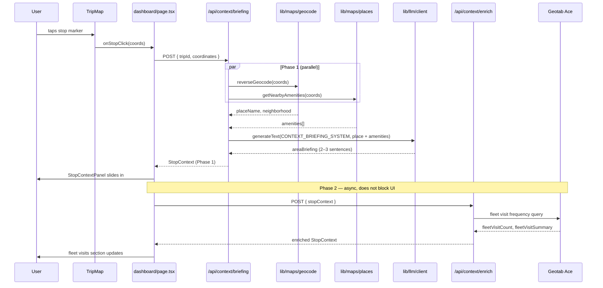
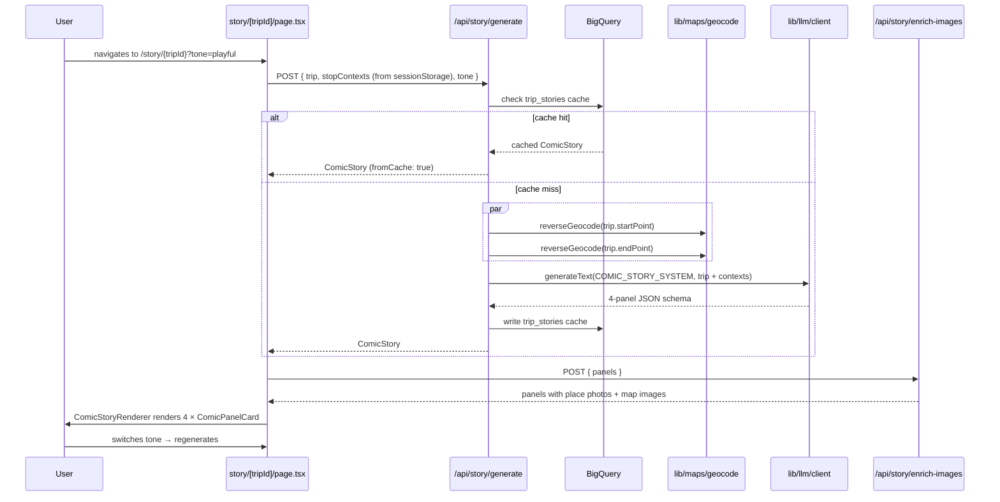
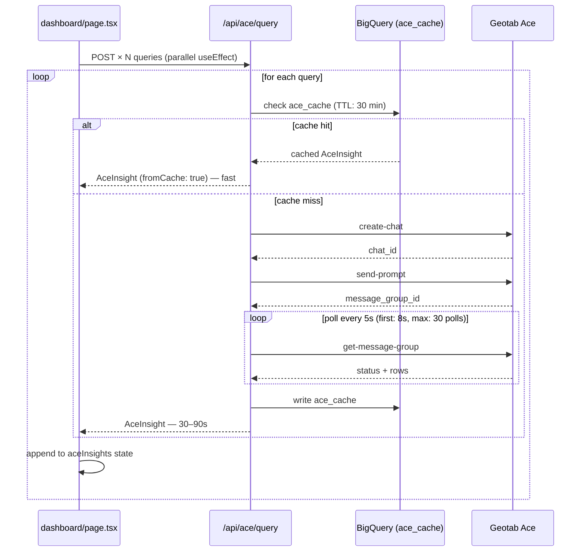
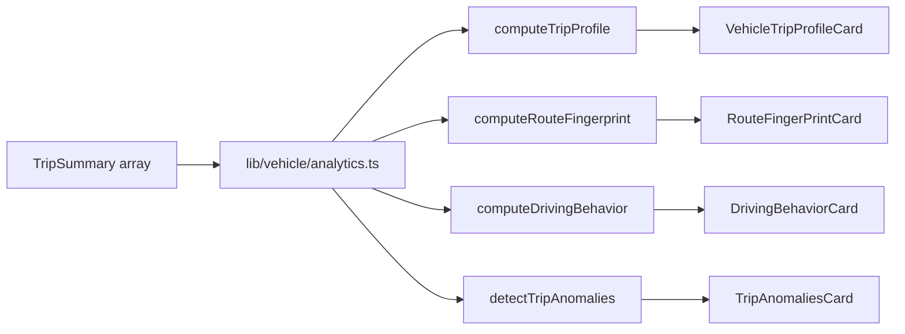

# FleetHappens

Fleet route intelligence, contextual stop briefings, vehicle analytics, and comic-style trip storytelling — built on the Geotab Direct API and Geotab Ace, deployed on Google Cloud Run.

FleetHappens turns raw Geotab trip data into five layers of value:

1. **Fleet Pulse** — company-wide KPI dashboard with group drill-down, regional vehicle map, ranked tables, daily AI digest, and fleet trend analytics, powered by Geotab Ace.
2. **Route Context Briefing** — tap any stop on a trip map and get an LLM-narrated area guide combining reverse-geocoded place data, nearby amenities, Ace fleet visit history, and a persistent location dossier.
3. **Vehicle Intelligence** — per-vehicle analytics cards (trip profile, route fingerprint, driving behavior, anomaly detection) computed client-side from trip history.
4. **Comic Trip Recap** — generate a 4-panel visual story from a trip's GPS breadcrumbs, enriched by stop context briefings. Export as PDF.
5. **AI Fleet Assistant** — natural-language command palette for querying fleet data across all integrated APIs.

---

## Table of Contents

- [Features](#features)
- [Quickstart](#quickstart)
- [Environment Variables](#environment-variables)
- [Architecture](#architecture)
- [Page Map](#page-map)
- [API Routes](#api-routes)
- [Key Data Flows](#key-data-flows)
- [LLM Provider Chain](#llm-provider-chain)
- [Offline / Demo Mode](#offline--demo-mode)
- [Deployment](#deployment)
- [Common Pitfalls](#common-pitfalls)

---

## Features

- **Per-user Geotab authentication** — users enter their own Geotab credentials on `/connect`; sessions are server-side encrypted cookies. Environment-level credentials can pre-fill a shared demo mode.
- **Fleet Pulse dashboard** — live KPI strip (total distance, active vehicles, idle %, top driver), fleet group drill-down, regional map of vehicle positions, Ace-powered ranked table, and fleet trend analytics from BigQuery.
- **Fleet Daily Digest** — AI-generated daily briefing with headline insights, anomaly alerts, next-week predictions, stat-of-the-day, and actionable recommendations.
- **Vehicle trip explorer** — select any vehicle, browse its recent trips, view GPS breadcrumbs and stop markers on a Leaflet map.
- **Vehicle intelligence cards** — client-side analytics from trip history: trip profile (distance trends, day-of-week patterns), route fingerprint (recurring origin-destination corridors), driving behavior (speed, idle, departure patterns), and trip anomaly detection (z-score outliers).
- **Stop Context Panel** — tap a stop marker → reverse-geocoded place name + LLM area briefing + nearby amenities + Ace fleet visit frequency for that location.
- **Location dossiers** — persistent profiles for visited locations stored in BigQuery, with knowledge depth tracking (Expert / Well Known / Familiar / Uncharted), visit history, and peak-day analysis.
- **Next-stop prediction** — multi-signal scoring (frequency, temporal, recency, sequence) with optional LLM reranking to predict a vehicle's next stop.
- **Comic Trip Story** — 4-panel comic generated by an LLM from real trip coordinates; three tones (Guidebook / Playful / Cinematic); stories cached in BigQuery. Panels enriched with place photos and map images.
- **Story Library** — browse all previously generated stories from BigQuery cache with tone filtering and pagination.
- **PDF export** — download comic stories as formatted PDFs with maps and place photos.
- **AI Fleet Assistant** — natural-language command palette (`Cmd+K`) with intent classification that routes queries to the appropriate API (Geotab, Ace, context, predictions).
- **Text-to-speech narration** — Google Cloud TTS reads stop briefings aloud (Journey-D voice).
- **Street View integration** — embedded Google Street View panorama for stop locations.
- **Full offline mode** — every API route falls back to pre-baked JSON in `public/fallback/` when live calls fail.

---

## Quickstart

**Prerequisites:** Node.js 18+, a Geotab demo database (60-day trial recommended), and optionally a Google Cloud project.

```bash
# 1. Install dependencies
npm install

# 2. Configure environment
cp .env.example .env.local
# Edit .env.local — at minimum set GEOTAB_DATABASE, GEOTAB_USERNAME, GEOTAB_PASSWORD

# 3. Run development server
npm run dev
# App starts at http://localhost:3002
```

> **Demo mode without credentials:** If `GEOTAB_PASSWORD` is wrong or not set, every API route automatically serves fallback JSON from `public/fallback/`. The UI shows a "demo data" banner. You can test the full UI without a live Geotab account.

```bash
# Type-check without building
npm run type-check

# Lint
npm run lint

# Production build (used by Docker)
npm run build && npm start
```

---

## Environment Variables

All variables are documented in `.env.example`. Key ones:

| Variable | Required | Description |
|---|---|---|
| `GEOTAB_DATABASE` | Yes | Geotab database name |
| `GEOTAB_USERNAME` | Yes | Geotab username |
| `GEOTAB_PASSWORD` | Yes | Geotab password |
| `GEOTAB_SERVER` | No | Defaults to `my.geotab.com` |
| `SESSION_SECRET` | Yes | 64-char hex string for session cookie encryption |
| `GOOGLE_CLOUD_PROJECT` | Recommended | Enables Vertex AI Gemini (primary LLM), BigQuery, and Cloud TTS |
| `GOOGLE_CLOUD_LOCATION` | No | Defaults to `us-central1` |
| `BIGQUERY_DATASET` | No | BigQuery dataset name; defaults to `fleethappens` |
| `GOOGLE_MAPS_API_KEY` | Recommended | Server-side geocoding, Places API, Static Maps (PDF export) |
| `NEXT_PUBLIC_GOOGLE_MAPS_API_KEY` | No | Client-side Street View panorama |
| `MAPBOX_ACCESS_TOKEN` | No | Optional Mapbox fallback for geocoding |
| `ANTHROPIC_API_KEY` | Fallback | Claude — used when `GOOGLE_CLOUD_PROJECT` is not set |
| `OPENAI_API_KEY` | Fallback | OpenAI — used when neither GCP nor Anthropic is set |
| `NEXT_PUBLIC_APP_URL` | No | App base URL; defaults to `http://localhost:3002` |
| `PULSE_DEMO_GROUPS` | No | Set `true` to force `/pulse` to use fallback group data |

Generate `SESSION_SECRET`:

```bash
node -e "console.log(require('crypto').randomBytes(32).toString('hex'))"
```

Local Vertex AI auth:

```bash
gcloud auth application-default login
```

---

## Architecture

```
fleethappens/
├── app/
│   ├── page.tsx                        ← Home: vehicle selector + nav
│   ├── connect/page.tsx                ← Geotab credentials form (per-user auth)
│   ├── features/page.tsx               ← Feature showcase / onboarding flow
│   ├── pulse/
│   │   ├── page.tsx                    ← Fleet Pulse: company-wide KPI dashboard
│   │   └── [groupId]/page.tsx          ← Group drill-down: vehicles in a fleet group
│   ├── dashboard/page.tsx              ← Trip explorer: trip list + map + intelligence cards
│   ├── story/[tripId]/page.tsx         ← Comic trip recap viewer
│   ├── storybook/page.tsx              ← Story library browser
│   ├── globals.css                     ← Tailwind base + CSS variables + Leaflet overrides
│   └── api/                            ← All server-side logic (see API Routes below)
│       ├── geotab/                     ← Auth, devices, trips, logs, status, groups
│       ├── ace/                        ← Ace query + pre-defined insights
│       ├── context/                    ← Stop briefing + fleet visit enrichment
│       ├── location/                   ← Location dossier CRUD
│       ├── story/                      ← Generate, enrich images, export PDF, library
│       ├── pulse/                      ← Fleet summary + group detail
│       ├── analytics/                  ← Fleet KPI trend history
│       ├── predict/                    ← Next-stop prediction
│       ├── digest/                     ← AI daily fleet digest
│       ├── assistant/                  ← Natural-language fleet assistant
│       ├── geocode/                    ← Reverse geocoding
│       └── tts/                        ← Text-to-speech
│
├── components/
│   ├── VehicleSelector.tsx             ← Fleet vehicle cards (home page)
│   ├── TripList.tsx                    ← Sidebar trip list with date grouping
│   ├── TripMap.tsx                     ← Leaflet map; GPS polyline + clickable stop markers
│   ├── TripStatsCard.tsx               ← Distance / duration / idle / speed strip
│   ├── StopContextPanel.tsx            ← Slide-in panel: place briefing + amenities + Ace
│   ├── LocationDossierPanel.tsx        ← Location dossier with knowledge depth gauge
│   ├── StreetViewPanel.tsx             ← Google Street View panorama
│   │
│   ├── VehicleTripProfileCard.tsx      ← Per-vehicle trip stats, distance trends, day patterns
│   ├── RouteFingerPrintCard.tsx        ← Recurring origin-destination corridors
│   ├── DrivingBehaviorCard.tsx         ← Speed, idle, departure pattern analysis
│   ├── TripAnomaliesCard.tsx           ← Statistical trip outlier detection
│   │
│   ├── AceInsightCard.tsx              ← Single Ace query result with bar chart
│   ├── AceInsightExpandedCard.tsx      ← Full-screen Ace result detail
│   ├── NextStopPrediction.tsx          ← Multi-signal next-stop prediction card
│   ├── NextStopExpandedCard.tsx        ← Expanded prediction with signal breakdown
│   │
│   ├── FleetCard.tsx                   ← Group KPI card (Pulse page)
│   ├── FleetPulseSummaryStrip.tsx      ← Company-wide stat strip
│   ├── FleetRankedTable.tsx            ← Ace-powered ranked vehicle table
│   ├── FleetMapSlider.tsx              ← Horizontal vehicle map slider
│   ├── FleetRegionalMap.tsx            ← Leaflet map of fleet vehicle positions
│   ├── FleetDailyDigest.tsx            ← AI daily digest: insights, anomalies, predictions
│   ├── VehicleActivityTable.tsx        ← Sortable, searchable vehicle activity table
│   ├── VehicleOutliersCard.tsx         ← Fleet outlier detection (distance, idle, trips)
│   ├── StopHotspotCard.tsx             ← Frequently visited stop clusters
│   ├── RoutePatternCard.tsx            ← Fleet-level top origin-destination pairs
│   │
│   ├── ComicStoryRenderer.tsx          ← 4-panel comic grid
│   ├── ComicPanelCard.tsx              ← Single panel: caption + bubble + map anchor
│   ├── story/ComicPanelImage.tsx       ← Panel image renderer (place photo / map / fallback)
│   ├── ToneSelector.tsx                ← Comic tone picker
│   │
│   ├── CommandPalette.tsx              ← Cmd+K AI fleet assistant
│   ├── ConnectButton.tsx               ← Auth status widget
│   └── ui/                             ← Radix-based primitives (button, card, badge, etc.)
│
├── lib/
│   ├── geotab/
│   │   ├── client.ts                   ← Direct API auth + calls; re-auth on session expiry
│   │   ├── normalize.ts                ← Raw Geotab response → typed models + x/y coord fix
│   │   ├── normalizers.ts              ← Additional normalizer helpers
│   │   ├── fallback.ts                 ← Geotab-specific fallback helpers
│   │   └── session.ts                  ← Per-user encrypted session management
│   ├── ace/
│   │   ├── client.ts                   ← create-chat → send-prompt → poll loop
│   │   ├── poller.ts                   ← Polling logic with retry and timeout
│   │   └── queries.ts                  ← Preset Ace question strings and query builders
│   ├── llm/
│   │   ├── client.ts                   ← Gemini (Vertex AI) → Claude → OpenAI chain
│   │   └── prompts.ts                  ← All LLM prompt templates
│   ├── maps/
│   │   ├── geocode.ts                  ← Google Geocoding → Nominatim (OSM) fallback
│   │   └── places.ts                   ← Google Places → Overpass API fallback
│   ├── bigquery/
│   │   └── client.ts                   ← ace_cache / trip_stories / fleet_snapshots / location_dossiers
│   ├── cache/
│   │   ├── fallback.ts                 ← withFallback() wrapper + loadFallback() loader
│   │   └── session.ts                  ← Session cache utilities
│   ├── assistant/
│   │   ├── analyze.ts                  ← Grounded analysis (dossier → LLM)
│   │   ├── intents.ts                  ← Intent classification definitions
│   │   ├── resolver.ts                 ← Intent → API call resolution
│   │   └── suggestions.ts             ← Follow-up suggestion generation
│   ├── context/
│   │   ├── briefing.ts                 ← Stop briefing logic
│   │   ├── orchestrator.ts             ← Phase 1 + Phase 2 orchestration
│   │   ├── amenities.ts               ← Nearby amenity resolution
│   │   ├── fleet.ts                    ← Fleet context helpers
│   │   └── geocode.ts                  ← Geocoding for context pipeline
│   ├── story/
│   │   ├── beats.ts                    ← Story beats extraction from trip data
│   │   ├── schema.ts                   ← Comic story schema definition
│   │   ├── prompts.ts                  ← Story-specific LLM prompts
│   │   ├── validate.ts                 ← LLM output validation
│   │   ├── place-resolution.ts         ← Place name resolution for panels
│   │   ├── place-photo.ts             ← Place photo fetching
│   │   ├── image-enrichment.ts         ← Panel image enrichment pipeline
│   │   └── pdf-builder.ts             ← PDF export via jspdf
│   ├── predict/
│   │   └── score.ts                    ← Multi-signal next-stop scoring
│   ├── location/
│   │   └── geohash.ts                  ← lat/lon → geohash conversion
│   ├── vehicle/
│   │   └── analytics.ts               ← Client-side trip analytics: profile, fingerprint, behavior, anomalies
│   ├── utils.ts                        ← cn() and shared utilities
│   └── fallback.ts                     ← General fallback helpers
│
├── types/
│   └── index.ts                        ← All shared TypeScript interfaces
│
├── public/
│   └── fallback/                       ← Pre-baked JSON for offline / demo mode (~79 files)
│
├── scripts/
│   └── gen-demo-trips.mjs             ← Script to generate demo trip fallback data
│
├── Dockerfile                          ← Multi-stage build; Next.js standalone output
├── cloudbuild.yaml                     ← Google Cloud Build → Artifact Registry → Cloud Run
├── .env.example                        ← Documented environment variable template
└── MY_PROJECT.md                       ← Original product spec and hackathon brief
```

### External Dependencies

| Service | Used for | Fallback |
|---|---|---|
| Geotab Direct API (`my.geotab.com/apiv1`) | Vehicle list, trips, GPS breadcrumbs, live positions, groups | `public/fallback/*.json` |
| Geotab Ace (`GetAceResults`) | Fleet-wide analytics, fleet visit frequency, ranked tables, insights | `public/fallback/ace-*.json` |
| Google Maps Geocoding API | Coordinates → place names | Nominatim (OSM) |
| Google Places API | Nearby amenities for stop context | Overpass API (OSM) |
| Vertex AI Gemini | Story generation, context briefings, assistant, digest, predictions | Claude → OpenAI |
| Google Cloud TTS | Audio narration of stop briefings | None |
| BigQuery | Caching Ace results, trip stories, fleet snapshots, location dossiers | In-memory / file fallback |

---

## Page Map

| Route | Description |
|---|---|
| `/` | Home — vehicle selector; shows live fleet or fallback data |
| `/connect` | Geotab credentials form; sets per-user session cookie |
| `/features` | Feature showcase with animated flow walkthrough |
| `/pulse` | Fleet Pulse — company-wide KPI strip + fleet group cards + regional map + daily digest |
| `/pulse/[groupId]` | Group drill-down — vehicles, outliers, hotspots, route patterns, Ace insight cards |
| `/dashboard` | Trip explorer — vehicle → trip list → GPS map → stop context → vehicle intelligence cards → next-stop prediction |
| `/story/[tripId]` | Comic recap — 4-panel story with tone selector and PDF export |
| `/storybook` | Story library — browse all generated comic stories |

---

## API Routes

All routes live under `app/api/`. Every route wraps its external call with `withFallback()` from `lib/cache/fallback.ts`, so it degrades to static JSON automatically.

### Geotab

| Route | Method | Description |
|---|---|---|
| `/api/geotab/auth` | GET | Returns current auth status and session info |
| `/api/geotab/connect` | POST | Authenticates with user-supplied Geotab credentials; sets session cookie |
| `/api/geotab/connect` | DELETE | Clears user session (logout) |
| `/api/geotab/devices` | GET | Returns `VehicleCard[]` from Geotab device list |
| `/api/geotab/trips` | GET | Returns `TripSummary[]` for a device + date range (7→30→90→365 day cascading fallback) |
| `/api/geotab/logs` | GET | Returns `BreadcrumbPoint[]` (GPS log records, decimated to ≤500 points) |
| `/api/geotab/status` | GET | Returns live `DeviceStatusInfo` positions |
| `/api/geotab/groups` | GET | Returns fleet group hierarchy (excludes system groups) |

### Ace Analytics

| Route | Method | Description |
|---|---|---|
| `/api/ace/query` | POST | Sends a question to Ace; polls until complete; returns `AceInsight` |
| `/api/ace/insights` | GET | Returns pre-defined fleet insights (top vehicles, idle breakdown, common stops, trip duration) |

Ace queries are asynchronous (30–90 seconds). The route handles the three-step poll flow internally:
1. `create-chat` → get `chat_id`
2. `send-prompt` → get `message_group_id`
3. `get-message-group` → poll every 5s (first poll after 8s) until `status === "DONE"`

Every call includes `customerData: true` — required or Ace returns empty data.

### Context Briefing

| Route | Method | Description |
|---|---|---|
| `/api/context/briefing` | POST | Phase 1: reverse geocodes stop coordinates, fetches nearby amenities, generates LLM area briefing |
| `/api/context/enrich` | POST | Phase 2: adds Ace fleet visit data (count, summary) to an existing `StopContext` |
| `/api/geocode` | GET | Reverse geocodes `lat`/`lon` to a human-readable place name |

### Location

| Route | Method | Description |
|---|---|---|
| `/api/location/dossier` | GET | Fetches a `LocationDossier` from BigQuery by lat/lon |
| `/api/location/dossier` | POST | Creates or updates a location dossier from `StopContext` data |

### Story

| Route | Method | Description |
|---|---|---|
| `/api/story/generate` | POST | Generates a `ComicStory` (4 panels) from trip data + optional stop contexts via LLM; checks BigQuery cache first |
| `/api/story/enrich-images` | POST | Adds place photos and map images to comic panels |
| `/api/story/export-pdf` | POST | Returns a binary PDF of the comic story with maps and photos |
| `/api/story/library` | GET | Paginated list of cached comic stories from BigQuery (supports tone filter, limit/offset) |

### Fleet Pulse & Analytics

| Route | Method | Description |
|---|---|---|
| `/api/pulse/summary` | GET | Returns `CompanyPulseSummary` with groups, vehicle counts, and active state |
| `/api/pulse/fleet/[groupId]` | GET | Fleet KPI snapshot for a group; writes to BigQuery `fleet_snapshots` |
| `/api/analytics/trends` | GET | Reads BigQuery `fleet_snapshots` for time-series trend data |

### Digest & Prediction

| Route | Method | Description |
|---|---|---|
| `/api/digest/generate` | POST | AI-generated daily fleet digest: headline, insights, anomaly alerts, predictions, recommendations |
| `/api/predict/next-stop` | GET | Next-stop predictions using Ace data + multi-signal scoring + optional LLM reranking |

### Other

| Route | Method | Description |
|---|---|---|
| `/api/assistant/query` | POST | AI assistant — classifies intent and routes to the appropriate API |
| `/api/tts` | POST | Returns audio narration (Google Cloud TTS, Journey-D voice) for a text input |

---

## Key Data Flows

### Stop Click → Context Panel



### Create Trip Story



### Ace Analytics (Non-blocking)



### Vehicle Intelligence (Client-side)



Vehicle intelligence cards require no API calls. `lib/vehicle/analytics.ts` takes `TripSummary[]` and computes all analytics client-side using geographic clustering (1.5 km radius), z-score analysis, and temporal pattern extraction.

---

## LLM Provider Chain

`lib/llm/client.ts` selects the LLM provider in priority order:

1. **Vertex AI Gemini** — when `GOOGLE_CLOUD_PROJECT` is set
   - `gemini-1.5-pro` for story generation (JSON mode via `responseMimeType: "application/json"`)
   - `gemini-2.0-flash-001` for context briefings, assistant, digest, and predictions (speed)
2. **Claude** (Anthropic) — when `ANTHROPIC_API_KEY` is set and GCP is not
3. **OpenAI** — when only `OPENAI_API_KEY` is set

All routes use the same `generateText()` interface, so swapping the provider requires no route changes.

---

## Offline / Demo Mode

Every API route is wrapped with `withFallback(key, fn)` from `lib/cache/fallback.ts`. When `fn()` throws (network error, bad credentials, rate limit), `withFallback` loads `public/fallback/{key}.json` instead.

See [`public/fallback/README.md`](public/fallback/README.md) for the complete naming convention and instructions for pre-populating fallback files.

To test offline mode end-to-end:

```bash
# Set a bad password in .env.local, then restart
GEOTAB_PASSWORD=wrong npm run dev
# Every screen should still load from fallback JSON
```

---

## Deployment

The app deploys to Google Cloud Run using the included `Dockerfile` and `cloudbuild.yaml`.

```bash
# One-shot deploy from source
gcloud run deploy fleethappens \
  --source . \
  --region us-central1 \
  --allow-unauthenticated \
  --set-env-vars "GOOGLE_CLOUD_PROJECT=<project>,NEXT_PUBLIC_APP_URL=https://your-url" \
  --set-secrets "GEOTAB_PASSWORD=GEOTAB_PASSWORD:latest,GOOGLE_MAPS_API_KEY=GOOGLE_MAPS_API_KEY:latest,SESSION_SECRET=SESSION_SECRET:latest"
```

- Sensitive values (`GEOTAB_PASSWORD`, `GOOGLE_MAPS_API_KEY`, `SESSION_SECRET`) are stored in Secret Manager and mounted at runtime.
- The `Dockerfile` uses a multi-stage build (Node 20 Alpine) with `output: "standalone"` in `next.config.mjs` and runs as a non-root `nextjs` user on port 8080.
- On Cloud Run, Vertex AI auth uses the attached service account (requires `roles/aiplatform.user` + `roles/cloudtextospeech.admin`).

---

## Common Pitfalls

| Issue | Cause | Fix |
|---|---|---|
| Ace returns empty rows | `customerData: true` missing | Already in `lib/ace/client.ts` — do not remove |
| Ace takes 60+ seconds | Expected behaviour | Ace queries are always slow; the dashboard fires them non-blocking with a loading skeleton |
| Map crashes on load | Leaflet requires `window` (SSR issue) | `TripMap` is loaded with `dynamic(..., { ssr: false })` — never import it directly in a server component |
| Coordinates are swapped | Geotab uses `x` = longitude, `y` = latitude | Normalization is done once in `lib/geotab/normalize.ts`; never read `stopPoint.x/y` raw |
| Distances look wrong | Geotab distances are in metres | `distanceKm` is pre-computed in `normalizeTrip()` |
| LLM returns markdown-wrapped JSON | Common GPT/Claude behaviour | `parseLLMOutput()` strips fences; Gemini JSON mode avoids this entirely |
| Session expiry mid-session | Geotab sessions expire | `lib/geotab/client.ts` re-authenticates on `InvalidUserException` |
| BigQuery table missing | First write creates the table | `lib/bigquery/client.ts` auto-creates tables; wait a few seconds after the first request |
| Ace has no data on fresh DB | New accounts need ~24 hours | Wait 24h after database creation; fallback JSON covers all Ace cards in the meantime |
| Trip query returns empty | Date range too narrow | Trip route cascades 7→30→90→365 days until results are found |
| PDF export fails | Missing `GOOGLE_MAPS_API_KEY` | Static Maps are used for panel images; set the key or panels fall back to gradient backgrounds |
