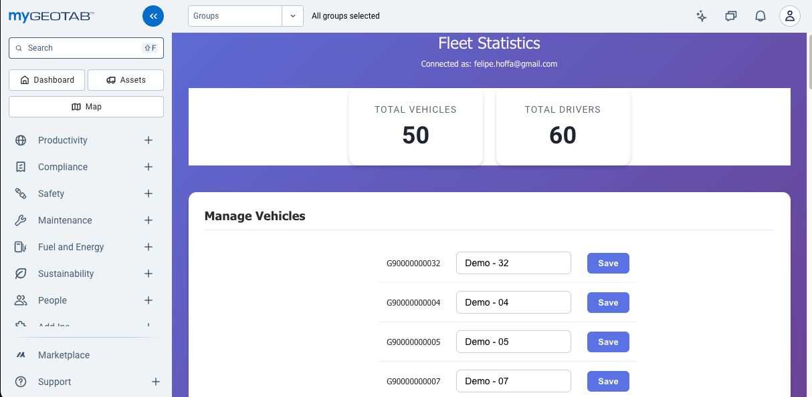
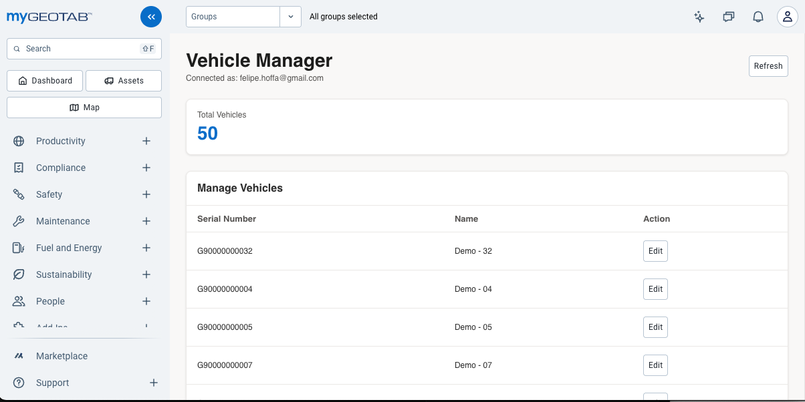

# Transform Add-In Design with Zenith

You have a working Add-In with vanilla JS/CSS. Should you transform it to Zenith for that polished MyGeotab look? Read this first.

> **AI Skill Available:** Use the [geotab-addin-zenith-styling skill](/skills/geotab-addin-zenith-styling/SKILL.md) to help your AI assistant with Zenith components and patterns.

---

## Advantages and Drawbacks

Before writing any code, understand what you're trading.

### What You Gain

**Professional appearance** - Your Add-In looks exactly like native MyGeotab pages. Same buttons, inputs, colors, fonts.

**Consistency** - Users don't notice they're in a custom Add-In. It feels integrated.

**Future-proof** - When Geotab updates their design, Zenith updates too.

### What You Lose

**Speed of iteration** - Every change requires a rebuild. Vanilla is edit → refresh. Zenith is edit → build → refresh.

**Easy debugging** - Errors in minified React bundles are cryptic. Vanilla JS errors point to the exact line.

**Small footprint** - Your 5 KB Add-In becomes 2.3 MB (fonts, React, components).

**Simplicity** - You now have a build pipeline: Node.js, npm, webpack, Babel. Things that can break.

### The Honest Trade-off

| | Vanilla | Zenith |
|---|---------|--------|
| **Time to first working version** | Minutes | Hours |
| **Time to iterate** | Seconds | Minutes |
| **Debugging** | Easy | Hard |
| **Looks like MyGeotab** | No | Yes |
| **Bundle size** | ~5 KB | ~2.3 MB |
| **Dependencies** | None | ~200 packages |

---

## When Zenith Is Worth It

**Yes, transform when:**
- The Add-In will be used by many people
- Professional appearance matters to stakeholders
- You're done iterating on features
- You have time for the build setup

**No, stay vanilla when:**
- It's an internal tool or prototype
- You're still figuring out what it should do
- You need to iterate quickly
- Bundle size matters (slow connections, mobile)

### Quick Decision

Ask yourself: **"Is the MyGeotab look worth an hour of build setup and slower iteration?"**

- If yes → Transform to Zenith
- If no → Keep vanilla, ship faster

**A working vanilla Add-In beats a broken Zenith one.**

---

## Before You Start

**Your vanilla version must work first.** Seriously. Don't skip this.

Debugging a broken Zenith app is much harder than debugging vanilla JS. Get your logic working, then transform.

---

## The Transformation Prompt

First, tell your AI to use the Zenith skill:

```
Use the geotab-addin-zenith-styling skill
```

Then point it to your existing code:

```
Look at my working Geotab Add-In in [folder path or GitHub URL].

Transform it to use React + Zenith (@geotab/zenith).

Keep the same functionality. Set up webpack to build a single bundle
that works in MyGeotab's iframe.

Create all the files I need and tell me how to build it.
```

That's it. The AI will:
- Read your existing code
- Create package.json, webpack.config.js, and React components
- Preserve your business logic
- Give you build instructions

---

## Common Gotchas

Things the AI might get wrong (and how to fix):

**"FeedbackProvider is not initialized"**
Tell AI: "Wrap the component with FeedbackProvider for Alert to work"

**"TextField is not exported"**
Tell AI: "Use TextInput instead of TextField, and Waiting instead of Spinner"

**Table component breaks**
Tell AI: "Use an HTML table with Zenith styling instead of the Zenith Table component"

**Errors are unreadable**
Tell AI: "Add source maps to webpack config for debugging"

---

## Working Example

Compare the results:

| Vanilla | Zenith |
|---------|--------|
|  |  |
| Custom styling with purple gradient | Matches MyGeotab's native look |

| Version | Preview | Source Code |
|---------|---------|-------------|
| **Vanilla** | [Preview](https://fhoffa.github.io/geotab-vibe-guide/examples/addins/vehicle-manager/vehicle-manager-preview.html) | [Source](https://github.com/fhoffa/geotab-vibe-guide/tree/main/examples/addins/vehicle-manager) |
| **Zenith** | [Preview](https://fhoffa.github.io/geotab-vibe-guide/examples/addins/vehicle-manager-zenith/dist/vehicle-manager-preview.html) | [Source](https://github.com/fhoffa/geotab-vibe-guide/tree/main/examples/addins/vehicle-manager-zenith) |

Same functionality. The Zenith version looks more polished but took longer to build and debug.

---

## Resources

- [Zenith Skill](/skills/geotab-addin-zenith-styling/SKILL.md) - AI skill with component patterns and gotchas
- [Add-Ins Guide](GEOTAB_ADDINS.md) - Start here for vanilla Add-Ins
